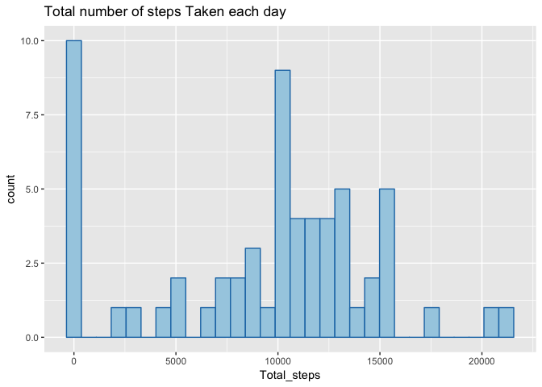
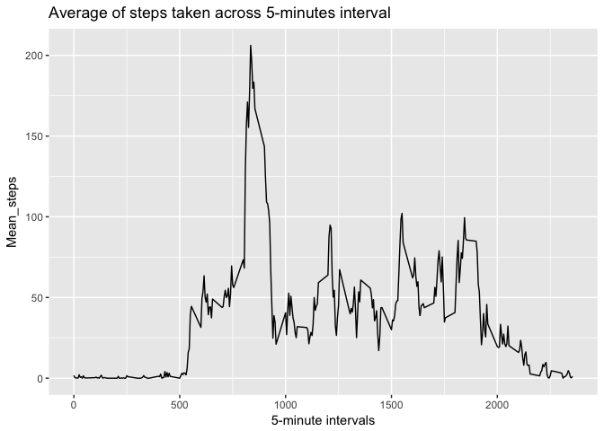
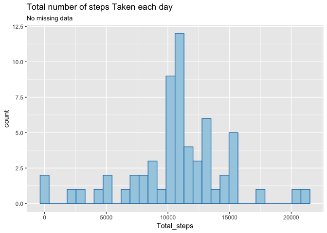
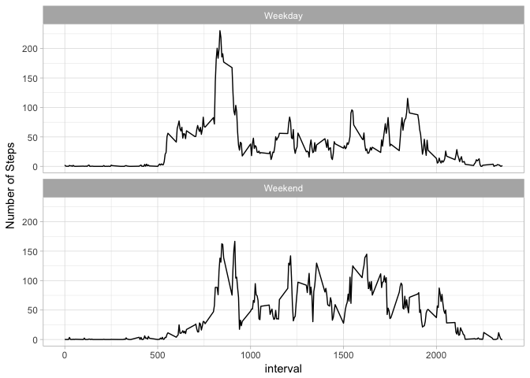

### Set options


```r
knitr::opts_chunk$set(echo = TRUE, message = FALSE, warning = FALSE,
                      comment = NA)
```

### Load required packages


```r
library(dplyr)
library(lubridate)
library(ggplot2)
library(knitr)
library(plotly)
```

### Load the data


```r
activity <- read.csv("activity.csv",header = TRUE)
## transform in date
activity$date <- ymd(activity$date)
```

### What is mean total number of steps taken per day?  
#### Histogram of the total number of steps taken each day

```r
bydate = activity %>%
    group_by(date) %>%
    summarise(N = n(), Total_steps = sum(steps, na.rm = TRUE))

ggplot(bydate, aes(x = Total_steps)) + geom_histogram(fill = "#A6CEE3", bins = 30, col = "#1F78B4") + ggtitle("Total number of steps Taken each day")
```

<!-- -->

#### Mean and median number of steps taken each day

```r
steps_summary <- bydate %>%
    summarise(Mean_steps = mean(Total_steps, na.rm = TRUE),
              Median_steps = median(Total_steps, na.rm = TRUE))

kable(steps_summary, align = 'l')
```


Mean_steps   Median_steps 
-----------  -------------
9354.23      10395        

### What is the average daily activity pattern?  
#### Time series plot of the average number of steps taken


```r
by_interval = activity %>%
    group_by(interval) %>%
    summarise(Mean_steps = mean(steps, na.rm = TRUE))
    
ggplot(by_interval, aes( x = interval, y = Mean_steps)) + geom_path() + labs(x = "5-minute intervals", title = "Average of steps taken across 5-minutes interval")
```

<!-- -->

#### These are the top 10 intervals for the average steps

```r
knitr::kable(activity %>%
    group_by(interval) %>%
    summarise(Mean_steps = mean(steps, na.rm = TRUE)) %>%
    group_by(interval) %>%
    summarise(Average_steps = mean(Mean_steps)) %>%
    arrange(desc(Average_steps)) %>%
    head(10), align = 'l')
```


interval   Average_steps 
---------  --------------
835        206.1698      
840        195.9245      
850        183.3962      
845        179.5660      
830        177.3019      
820        171.1509      
855        167.0189      
815        157.5283      
825        155.3962      
900        143.4528      

### Imputing missing values

#### Code to describe and show a strategy for imputing missing data


```r
## Total number of Rows with missing values
sum(apply(activity, 1, FUN = function(x) {sum(is.na(x))}))
```

```
[1] 2304
```

```r
#### Replace missing values with the mean for the interval ####

##create a merged dataset
new_df <- merge(activity, by_interval, by = "interval")

## substitute values
new_df$steps[is.na(new_df$steps)] <-  new_df$Mean_steps[is.na(new_df$steps)] 

new_df <- new_df %>%
    arrange(date) %>%
    select(steps, date, interval)

new_df$steps <- round(new_df$steps, digits = 0)

## the two datasets are equal but the new_df has no missing data
kable(head(new_df, 10), align = 'l')
```


steps   date         interval 
------  -----------  ---------
2       2012-10-01   0        
0       2012-10-01   5        
0       2012-10-01   10       
0       2012-10-01   15       
0       2012-10-01   20       
2       2012-10-01   25       
1       2012-10-01   30       
1       2012-10-01   35       
0       2012-10-01   40       
1       2012-10-01   45       

```r
kable(head(activity, 10), align = 'l')
```


steps   date         interval 
------  -----------  ---------
NA      2012-10-01   0        
NA      2012-10-01   5        
NA      2012-10-01   10       
NA      2012-10-01   15       
NA      2012-10-01   20       
NA      2012-10-01   25       
NA      2012-10-01   30       
NA      2012-10-01   35       
NA      2012-10-01   40       
NA      2012-10-01   45       

#### Histogram of the total number of steps taken each day after missing values are imputed


```r
by_date_new <- new_df %>%
    group_by(date) %>%
    summarise(N = n(), Total_steps = sum(steps, na.rm = TRUE))

ggplot(by_date_new, aes(x = Total_steps)) + geom_histogram(fill = "#A6CEE3", bins = 30, col = "#1F78B4") + ggtitle("Total number of steps Taken each day", subtitle = "No missing data")
```

<!-- -->

```r
steps_summary_new <- by_date_new %>%
    summarise(Mean_steps = mean(Total_steps, na.rm = TRUE),
              Median_steps = median(Total_steps, na.rm = TRUE))

kable(steps_summary_new, align = 'l')
```


Mean_steps   Median_steps 
-----------  -------------
10765.64     10762        

Mean and Median are not the same. They have become higher, as expected.

### Are there differences in activity patterns between weekdays and weekends?


```r
new_df$Weekday <- weekdays(new_df$date)
new_df$Week_part <- ifelse(new_df$Weekday %in% c("Sabato", "Domenica"), "Weekend", "Weekday")
head(new_df)
```

```
  steps       date interval Weekday Week_part
1     2 2012-10-01        0  Lunedì   Weekday
2     0 2012-10-01        5  Lunedì   Weekday
3     0 2012-10-01       10  Lunedì   Weekday
4     0 2012-10-01       15  Lunedì   Weekday
5     0 2012-10-01       20  Lunedì   Weekday
6     2 2012-10-01       25  Lunedì   Weekday
```

#### Panel plot comparing the average number of steps taken per 5-minute interval across weekdays and weekends


```r
n = new_df %>%
    group_by(interval, Week_part) %>%
    summarise(mean_score = mean(steps))

ggplot(n, aes(x = interval, y = mean_score)) + geom_path() +
    facet_wrap(~Week_part, nrow = 2) + ylab("Number of Steps") + theme_light()
```

<!-- -->

